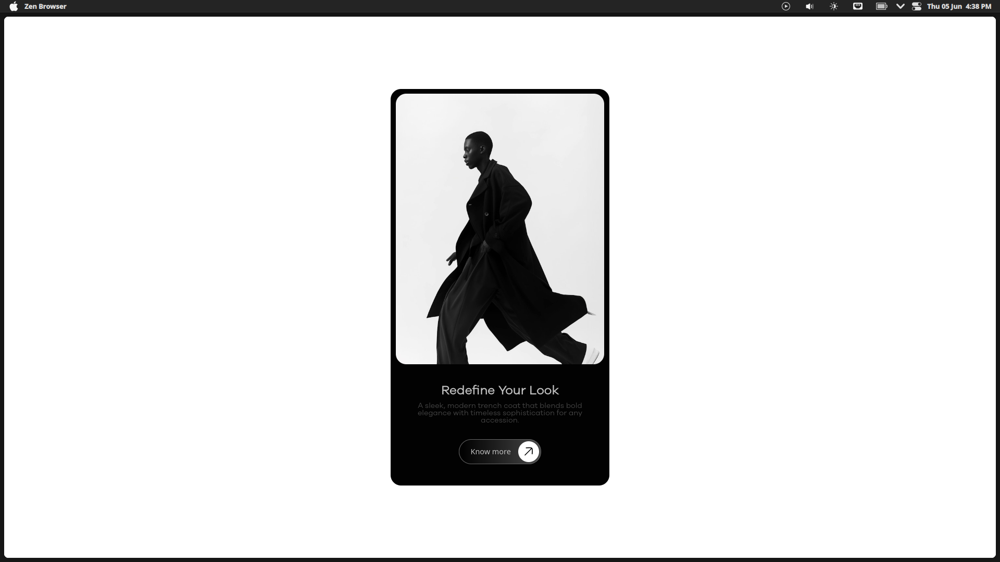

# 🖤 Redefine Your Look - Fashion Card UI

A minimal, modern UI card built using **HTML & CSS only**, ideal for showcasing fashion items, portfolios, or elegant product displays.

## ✨ Features

- Fully responsive design
- Clean, minimal layout
- Smooth hover interaction on the CTA
- Pure HTML + CSS — no frameworks or JS used
- Suitable for fashion, product highlights, or landing pages

## 📸 Preview



## 🛠️ Tech Stack

- HTML5
- CSS3


## 🚀 Getting Started

To run this project locally:

1. Clone the repository:
   ```bash
   git clone https://github.com/asianprogrammer/Card.git Card_UI
   cd Card_UI
